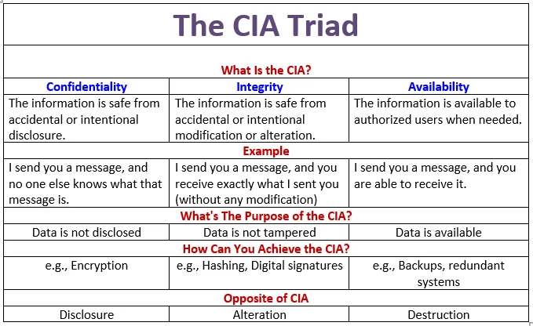
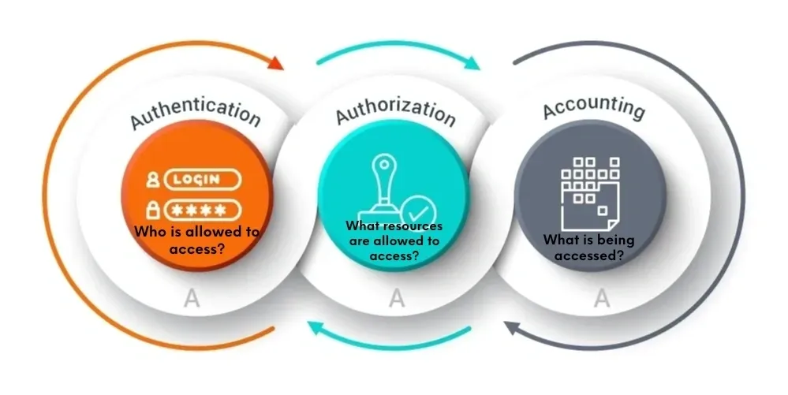

# Summary fundamental security concepts

## Non-Repudiation

- A service that provides proof of the integrity and origin of data
  - Example: digital signing of e-mail messages to prove that the message received was actually sent by the purported sender

 

## CIA Triad

- Confidentiality
- Integrity
- Availability

  

 

## Triple A’s of Security

- Authentication
- Autorization
- Accounting

  

 

## Zero Trust Model = Assume Nothing, Verify Everything

Operates on the principle that no one should be trusted by default

#### Control Plane

The control plane refers to the part of a network that carries signaling traffic and is responsible for routing

- Adaptive identity
- Threat scope reduction
- Policy-driven access control
- Policy Administrator
- Policy Engine

#### Data Plane / User Plane

The data plane involves the part of a network that carries user traffic

- Implicit trust zones
- Subject/System
- Policy Enforcement Point

 

## Physical Security

- Bollards
- Access control vestibule
- Fencing
- Video surveillance
- Security guard
- Access badge
- Lighting
- Sensors
  - Infrared
  - Pressure
  - Microwave
  - Ultrasonic

 

## Deception and disruption technology

- Honeypot
- Honeynet
- Honeyfile
- Honeytoken
